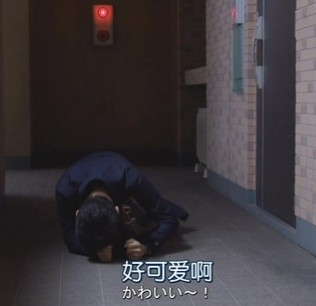

### 20200905握手会朱苓repo

> 作为一名新饭，第一次参加握手会非常紧张加激动，见到苓苓后全程内心OS：



#### 1.   第二轮3张 #### 

	我：00你好，是第一次来的饭呢。
	苓苓：紧不紧张？
	我：(点头)很紧张
	苓苓：那你的id是什么？
	我：C lucky 酱
	苓苓：哦我知道了，我还以为这是个女孩子的名字。
	我：女孩子的名字吗？
	苓苓：是的，因为我觉得很可爱(笑
	     但我是不是把你的id念错了?
	我：没有哦，我在C/siː/lucky酱和Clucky[ˈklʌki]酱中纠结，还是觉得C/siː/ lucky酱比较好听呢
	苓苓：这样啊
	被staff推
	我：等下还会再来哦，拜拜
	苓苓：(挥手)拜拜


#### 2.   第二轮2张

```
我：刚才真是太紧张了，本来准备了一堆夸苓苓的话都没有说。
苓苓：那现在趁着有机会快说！
我：苓苓真的是太太太可爱了，能和苓苓相遇真是太好了！
苓苓：好的，谢谢你！赶快抓紧时间接着说，不能把时间浪费了(为我握手券着想的好偶像
我：(脑子卡壳中)我果然还是太紧张了(思考了两秒刚准备说话被staff推)

(p.s. 这里我超后悔自己脑子卡壳了，下次应该要把《神推偶像》里飘哥的5s神表白给背下来说给苓苓听(

我：拜拜，待会儿见~
苓苓：(挥手)拜拜
```


#### 3.   第三轮2张

```
我：苓苓最近有在玩动森吗？
苓苓：有啊，我最近又开始继续规划岛建了
我：那00的岛应该建得很漂亮吧？
苓苓：(皱眉+摇头.gif)不行不行，完全不行
我：那真是饭随偶像了，网上有很多教程但我因为懒就没有去做。
苓苓：有些教程都好难啊
我：岛建真的不容易呢…
苓苓：点头
被推
我：拜拜，待会儿见
苓苓：拜拜
```


#### 4.   第四轮2张

```
我：苓苓你好，今天最后一次来了呢。
苓苓：伤心状.jpg
我：最近在做一些出国念书的准备工作，因为词汇量不行所以定了每天记单词的计划，苓苓能鼓励我一下让我坚持每天记单词吗？
苓苓：(点头)好的，要坚持下去，努力去实现自己的梦想，去赚大钱(笑。
```

 ~~(好的，我一定好好学习敲代码之后去996做一个快乐的 ==ATM==（大雾）~~

```
我：好的，谢谢苓苓的鼓励！
苓苓：要一起加油！
被推
苓苓：(挥手)拜拜，公演见哦
我：好的，拜拜！（有时间的话会去看的
```

p.s.  因为在商场握手，我听到好几位路人在对着苓苓夸"前面这位小姐姐好可爱啊！" 果然苓苓的可爱是大家所公认的！

